# Machine Learning with Azure

**Introducción.**

Si buscas automatizar algún proceso o predecir algún dato obtenido de un conjunto de datos mediante el aprendizaje automático pero no poseés conocimientos en dicha área esto te puede ayudar, ya que una inteligencia artificial ayudara a crear un modelo de Machine Learning para tu conjunto de datos.
Para lograr esto es necesario contar con una cuenta de Azure, si no cuentas con una puedes crear una [Aquí](https://azure.microsoft.com/es-es/get-started/azure-portal/).

**Aquí haré una demostración de como usar ML Studio por lo que puedes hacerlo como yo o acomodar los parámetros de acuerdo a lo que necesites**

También te dejare una muestra del código fuente que te proporcionara ML Studio cuando complete el proceso y te genere el modelo, lo podrás obtener en Python y C#. La carpeta es *ML-Model.py*.

----------------------------------------------

### Paso 1: Crear un área de trabajo en Azure.

Para hacer esto de forma más sencilla recomiendo enntrar a [ML Studio](https://ml.azure.com/), ya que será más fácil crear tu área de trabajo.
Una vez dentro ingresa tu cuenta de Azure y crea una área de trabajo.
Dale el nombre y la región que gustes. Si no tienes un grupo de recursos puedes crear uno ahí mismo.

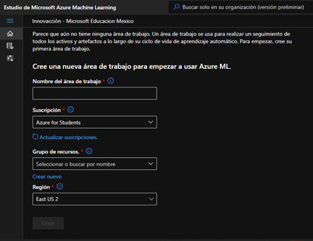

------------------------------

### Paso 2: Crear una instancia de proceso y un cluster de proceso.

- **Creación de una instancia de proceso**.
Una vez que tu área de trabajo se encuentre creada dirígete al lado izquierdo y busca **Instancia de proceso**.

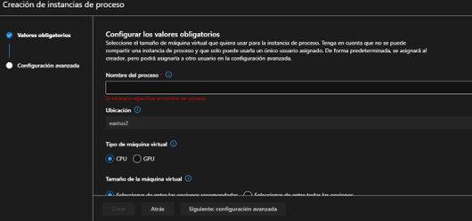

Puedes seleccionar entre CPU y GPU, la diferencia entre estas es que la GPU hará el proceso mucho más rápido que la CPU y por ende es más cara.
En mi caso usare CPU con una VM (Maquina Virtual) estandar (Estandar DS11_v2), ya que no necesito hacer procesos tan exigentes pero tu puedes seleccionar la que gustes.

- **Creación de un cluster de proceso**.
La cración de este es porque esta dedicado a la creación de *Machine Learning* que es lo que bsucamos hacer.
En el apartado de proceso encontraras el **cluster de proceso**, da clic en este y cra uno.

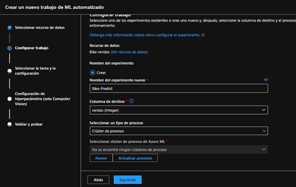

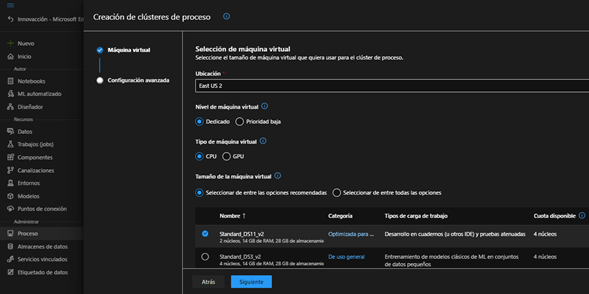

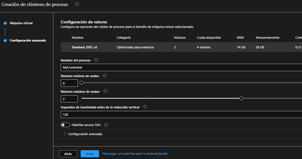

- La VM que yo use es la estandar pero puedes más o menos potente de aucerdoa lo que necesites.
- El mínimo de nodos en 0 es para que cuando no se este usando el cluster de proceso baje su uso hasta 0 nodos y evitar que te siga cobrando.
- Entre más nodos le pongas al máximo el proceso se realizara más rápido.

    **Nota**: Puedes ajustar los parámetros de acuerdo a lo que estes buscando o de acuerdo a la cantidad de proceso que busques relizar, también puedes dejarlos como yo los tengo pero te recuerdo que en mi caso es un proceso simple, ya que solo busco darte una demostración de esta herramienta.

------------------------------------------

### Paso 3: Creación del recurso.

- 1. Vamos a crear un recurso para ello primero buscaremos en el lateral izquierdo **Datos**.
    - Te apareceran 4 opciones al darle clic en crear.
    - Elige la obción donde tengas almacenados los datos.
    - Si no poseés un dataset te proporcionaré el que yo utilicé para la demostración [Dataset](https://aka.ms/bike-rentals), para este conjunto de datos selecciona **de archivos web**.

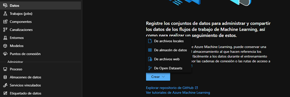

- 2. Una vez seleccionado el lugar de donde proporcionaras los datos, subelos y rellena los campos que te pida. Al finalizar dale clic en siguiente.

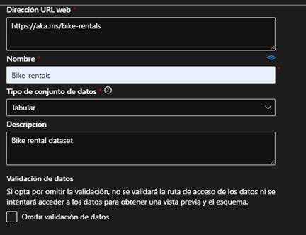

- 3. En la siguiente pestaña deberas delimitar los parámetros de tu conjunto de datos. También te mostrará una vista previa ded dicho conjunto. Al terminar da clic en crear.

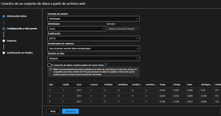

**Nota**: Para el conjunto de datos que te proporcione solo elige como delimitador la coma y los encabezados solo en el primer archivo, lo demas dejalo en default.

------------------------------------------

### Paso 4: Creación del ML Automatizado.

Cuando la creación del recurso haya concluido, en el lateral izquierdo bsuca **ML Automatizado**. Da clic en crar uno nuevo.

- 1. Cuando se abra la pestaña vas a seleccionar el dataset que creaste anteriormente y le darás en siguiente.

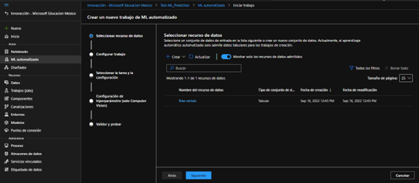

La columna de destino es lo que tu estas buscando predecir de tu datset, para mi caso estoy buscando obtener una predicción de cuantas rentas de bicis habrá a partir del resto de datos que contiene mi dataset.

- 2. Selecciona el cluster de proceso que ya creaste anteriormente para tu tipo de proceso y da clic en siguiente.

- 3. El siguiente apartado te dará a escoger el modelo a implementar para tu *Machine Learning*.

Para mi modelo haré uso de **Regresión** porque es justo lo que necesito para predecir un valor a partir de un conjunto de datos.

Si no sabes que modelo implementar en tu dataset te dejo aquí algo que te ayudara a escoger el mejor modelo para tu caso [Aquí](https://aka.ms/mlcheatsheet).

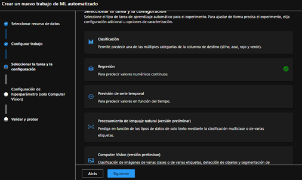

Cuanto escojas tu modelo da clic en siguiente.

- 4. Por ultimo puedes dejar los valores por default a menos que tengas otro conjunto de datos extra que quieras proporcionarle.

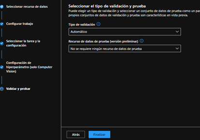

Da clic en finalizar y espera a que se cree tu modelo. Esto puede tardar varios minutos dependiendo de la VM que hayas escogído y de la cantidad de nodos máximos que hayas puesto.

------------------------------------

### Paso 5: Testing e implementación.

Este paso es opcional, con lo anterior ya tienes creado tu modelo de ML Automático pero si buscas probarlo o incluso implementarlo como web service haz lo siguiente:

- 1. Cuando este crado da clic en **Modelo** y posteriormente en **Implementar**.
        - Habilita la autenticación y en el entorno de proceso puedes usar kubernetes para que sea más sencillo el proceso.

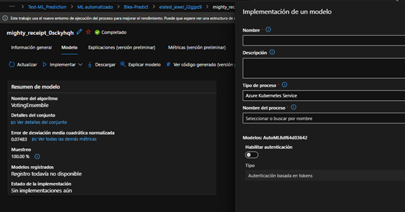

- 2. Al finalizar entra a puntos de conexión y espera a que se termine de crear, esto puede tardar varios minutos. Puedes darle refresh cada 2 min a la página para que veas si ya se implemento.

- 3. Cuando ya se implemente puedes usar la API para ofreser un servicio web o entrar al área de pruebas y testearlo.

